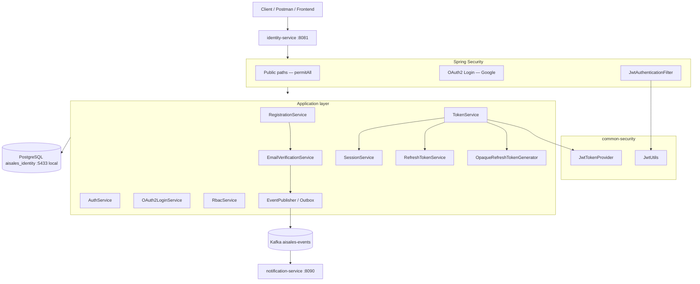

# Identity Service — Authentication Technical Guide

Complete technical reference for **identity-service**: how authentication and authorization work, which classes participate, and how JWT, opaque refresh tokens, OAuth2, sessions, and RBAC fit together.

**Service:** `identity-service` · **Port:** `8081` · **Database:** `aisales_identity`  
**Local dev profile:** `local` (default) · **Local Postgres port:** `5433` (Docker)

---

## Table of contents

1. [Learning path — read this first](#1-learning-path--read-this-first)
2. [Core concepts](#2-core-concepts)
3. [Token model — access JWT vs opaque refresh](#3-token-model--access-jwt-vs-opaque-refresh)
4. [Architecture overview](#4-architecture-overview)
5. [Security filter chain](#5-security-filter-chain)
6. [Layer responsibilities](#6-layer-responsibilities)
7. [Authentication flows (step by step)](#7-authentication-flows-step-by-step)
8. [JWT deep dive](#8-jwt-deep-dive)
9. [Refresh token deep dive](#9-refresh-token-deep-dive)
10. [Google OAuth2 deep dive](#10-google-oauth2-deep-dive)
11. [RBAC and permissions](#11-rbac-and-permissions)
12. [Database schema](#12-database-schema)
13. [REST API reference](#13-rest-api-reference)
14. [Local development and Postman](#14-local-development-and-postman)
15. [Configuration reference](#15-configuration-reference)
16. [Class participation matrix](#16-class-participation-matrix)
17. [Service boundaries](#17-service-boundaries)
18. [Troubleshooting](#18-troubleshooting)
19. [Related resources](#19-related-resources)

---

## 1. Learning path — read this first

If you are new to this service, read in this order:

| Step | Topic | Section |
|------|-------|---------|
| 1 | What tokens exist and why | [§2 Core concepts](#2-core-concepts), [§3 Token model](#3-token-model--access-jwt-vs-opaque-refresh) |
| 2 | Register → verify email → login → protected API | [§7 Flow A, B, H](#7-authentication-flows-step-by-step) |
| 3 | **When JWT is created** (and when it is not) | [§3.4 When JWT is created](#34-when-jwt-is-created), [§8.3](#83-where-jwt-is-created-vs-validated) |
| 4 | How JWT is validated on each request | [§5 Security filter chain](#5-security-filter-chain), [§8 JWT deep dive](#8-jwt-deep-dive) |
| 5 | How refresh works without re-login | [§9 Refresh token deep dive](#9-refresh-token-deep-dive) |
| 6 | Email verification & notification-service | [§7 Flow H](#flow-h--email-verification), [§17 Service boundaries](#17-service-boundaries) |
| 7 | Google login alternative | [§10 Google OAuth2](#10-google-oauth2-deep-dive) |
| 8 | Try it in Postman | [§14 Local development](#14-local-development-and-postman) |

**Mental model in one sentence:**  
The client **registers** an account → **verifies email** (link or API) → **proves identity** (password or Google login) → **identity-service** issues a **short-lived JWT** for API calls and an **opaque refresh token** in PostgreSQL → every protected request sends the JWT → the filter validates it and sets tenant/user context. **JWT is not created at register or verify-email** (by default).

---

## 2. Core concepts

### 2.1 What identity-service owns

| Capability | Owner | Notes |
|------------|-------|-------|
| User credentials (email + password hash) | identity-service | BCrypt, never plain text |
| JWT access tokens | identity-service signs them (RS256) | Validated via JWKS / public key (no shared secret) |
| Refresh tokens | identity-service | Opaque random strings in `refresh_tokens` table |
| Sessions | identity-service | Device/IP tracking linked to refresh token |
| Google OAuth linkage | identity-service | `oauth_accounts` table |
| RBAC permission catalog | identity-service | Roles → permissions resolved at token issue |
| Tenant created at registration | identity-service | `tenants` + FREE subscription |
| Email verification tokens | identity-service | `email_verification_tokens` table |
| Transactional email delivery | **notification-service** | Consumes identity outbox events (`EmailVerificationRequested`, `PasswordResetRequested`) |

### 2.2 Three ways to authenticate

| Mode | When | Mechanism |
|------|------|-----------|
| **Credential auth** | Register, login | Email + BCrypt password → tokens issued |
| **Bearer auth** | Every protected API | `Authorization: Bearer <accessToken>` |
| **OAuth2 auth** | Google login | Spring OAuth2 client → same token pipeline |

### 2.3 Stateless vs persisted

| Artifact | Stored where | Purpose |
|----------|--------------|---------|
| **Access token (JWT)** | Client only (memory/localStorage) | Authorize API calls; expires ~1 hour |
| **Refresh token (opaque)** | Client + PostgreSQL | Get new access token without password |
| **Session row** | PostgreSQL only | Audit, list devices, link to refresh token |
| **Password hash** | PostgreSQL only | Verify login; never sent to client |

The platform is **stateless for API authorization** (JWT) but **stateful for refresh/logout** (DB-backed revocation).

### 2.4 Registration ≠ authentication

| Concern | Service | Question it answers |
|---------|---------|-------------------|
| Account lifecycle | `RegistrationService` | "Create tenant + user account" |
| Identity proof | `AuthService` / `OAuth2LoginService` | "Prove you are this user" |
| Token issuance | `TokenService` | "Issue tokens after identity is established" |

Registration **creates** an account. Login **proves** identity. They are intentionally separate.

### 2.5 Email verification (required before login)

By default:

| Setting | Default | Effect |
|---------|---------|--------|
| `aisales.auth.auto-login-after-register` | `false` | **No JWT** returned on register |
| `aisales.auth.require-email-verification-for-login` | `true` | Login blocked until `users.email_verified = true` |

Registration always sets `emailVerificationRequired: true` and publishes `EmailVerificationRequested` via outbox; **notification-service** delivers the email.

---

## 3. Token model — access JWT vs opaque refresh

This is the most important design decision in the current implementation.

### 3.1 Two-token pattern

```
┌─────────────────────────────────────────────────────────────────┐
│                        After login/register                      │
├────────────────────────────┬────────────────────────────────────┤
│ ACCESS TOKEN (JWT)         │ REFRESH TOKEN (opaque)              │
├────────────────────────────┼────────────────────────────────────┤
│ Format: eyJhbGciOiJ...     │ Format: random Base64 URL (~43 chars)│
│ Signed by RS256 (RSA)      │ NOT a JWT — random bytes            │
│ Contains: userId, tenant,  │ Stored in refresh_tokens table      │
│   roles, permissions       │ Lookup by exact string match        │
│ TTL: ~1 hour               │ TTL: ~24 hours (DB expires_at)      │
│ Sent on every API call     │ Sent only to /auth/refresh, /logout │
│ Cannot be revoked early*   │ Revoked in DB (logout, rotation)    │
└────────────────────────────┴────────────────────────────────────┘
* Access token valid until expiry; short TTL limits risk.
```

### 3.2 Why refresh tokens are opaque (not JWT)

Earlier versions stored a **signed JWT refresh token** with full roles and permissions. That caused:

- Very long tokens (thousands of characters with many permissions)
- Database column overflow (`varchar(512)`)
- Unnecessary duplication of permission data

**Current design (correct for production):**

1. `JwtTokenProvider.generateAccessToken()` — creates **access JWT only**
2. `OpaqueRefreshTokenGenerator.generate()` — creates **32 random bytes → Base64 URL string**
3. `RefreshTokenService.createRefreshToken()` — persists opaque string in PostgreSQL
4. Client receives both in `AuthResponse`

On refresh, the server **does not parse the refresh value as JWT**. It only looks up:

```java
refreshTokenRepository.findByTokenAndRevokedFalse(request.getRefreshToken())
```

### 3.3 Token issuance pipeline (`TokenService`)

**Class:** `application.service.TokenService`  
**Method:** `issueTokens(User user, String ipAddress, String userAgent)`

```
User
  → RbacService.resolvePermissions(roles)
  → JwtService.generateAccessToken(user, permissions)     // JWT access only
  → OpaqueRefreshTokenGenerator.generate()                // random refresh string
  → RefreshTokenService.createRefreshToken(userId, opaque) // DELETE old + INSERT new
  → SessionService.createSession(userId, refreshToken, ip, userAgent)
  → AuthResponse { accessToken, refreshToken, roles, permissions, ... }
```

**Who calls `TokenService`?**

| Caller | When |
|--------|------|
| `AuthService.login()` | Password verified |
| `AuthService.refresh()` | Old refresh token valid (after rotation setup) |
| `OAuth2LoginService` | Google login success |
| `RegistrationService` | Only if `aisales.auth.auto-login-after-register=true` (default: **false**) |

### 3.4 When JWT is created

The **access JWT is created only** inside `TokenService.issueTokens()` → `JwtService.generateAccessToken()` → `JwtTokenProvider.generateAccessToken()`.

| Event | JWT created? | Opaque refresh created? |
|-------|:------------:|:-----------------------:|
| **Register** | No (default) | No |
| **Register** (if `auto-login-after-register=true`) | Yes | Yes |
| **Verify email** | No | No |
| **Login** (password) | Yes | Yes |
| **Refresh** | Yes (new pair) | Yes (rotated) |
| **Google OAuth** | Yes | Yes |
| **Forgot / reset password** | No | No |
| **Logout** | No | No (revokes existing refresh) |

**Typical first-time user path:** Register → verify email → **Login** → JWT issued.

---

## 4. Architecture overview



### Design split: registration vs authentication vs tokens

```
RegistrationService          AuthService / OAuth2LoginService
        │                              │
        │  (optional auto-login)         │  (after identity proof)
        └──────────┬─────────────────────┘
                   ▼
             TokenService.issueTokens()
                   │
       ┌───────────┼───────────┐
       ▼           ▼           ▼
  JwtService   OpaqueRefresh   SessionService
  (access JWT) TokenGenerator
```

---

## 5. Security filter chain

**Class:** `infrastructure.configuration.IdentitySecurityConfig`

identity-service uses its **own** security config (not the platform default):

```yaml
aisales.security.use-platform-defaults: false
```

This enables OAuth2 login and avoids duplicate `securityFilterChain` beans from `common-security`.

### 5.1 Filter order (simplified)

```
HTTP Request
  → CorrelationIdFilter          (common-starter — tracing)
  → LoggingFilter
  → Spring Security chain
       → OAuth2 redirect handlers (for /oauth2/**)
       → JwtAuthenticationFilter  ← reads Bearer JWT
       → Authorization (authenticated / permitAll)
  → Controller
```

### 5.2 JwtAuthenticationFilter behavior

**Class:** `common.security.filter.JwtAuthenticationFilter`

For each request:

1. Read header: `Authorization: Bearer <token>`
2. If present → `JwtUtils.parseClaims(token)`
3. If not expired → build `UserPrincipal`
4. Set `SecurityContextHolder` authentication
5. Set `TenantContext.setUserId()`
6. Enable Hibernate tenant filter

If token missing on **public** path → request continues without authentication.  
If token missing/invalid on **protected** path → **401 Unauthorized**.

### 5.3 Public paths (no JWT required)

Defined in `SecurityConstants.PUBLIC_PATHS`:

| Path pattern | Examples |
|--------------|----------|
| `/api/v1/auth/**` | register, login, refresh, forgot-password |
| `/oauth2/**`, `/login/oauth2/**` | Google OAuth |
| `/actuator/**` | health |
| `/v3/api-docs/**`, `/swagger-ui/**` | OpenAPI |

All other paths require a valid access JWT.

---

## 6. Layer responsibilities

### 6.1 API layer

| Class | Role |
|-------|------|
| `AuthController` | Auth HTTP endpoints; extracts IP + User-Agent; wraps `ApiResponse` |
| `SubscriptionController` | Plan and feature checks (requires JWT) |
| `RegisterRequest` | `email`, `password`, `firstName`, `lastName`, `companyName` |
| `RegistrationResponse` | Tenant/user metadata + optional `authentication` |
| `AuthResponse` | `accessToken`, `refreshToken`, `roles`, `permissions` (common-contracts) |

`AuthController` has **no business logic** — only validation and delegation.

### 6.2 Application services

| Service | Responsibility |
|---------|----------------|
| `RegistrationService` | Tenant onboarding: tenant, subscription, admin user, events, optional tokens |
| `AuthService` | Login, refresh, logout, verify email, password reset, sessions |
| `TokenService` | **Single place** that issues access JWT + opaque refresh + session |
| `JwtService` | Adapter: `User` → `JwtTokenProvider.generateAccessToken()` |
| `OpaqueRefreshTokenGenerator` | Cryptographically secure random refresh token string |
| `RefreshTokenService` | Persist/revoke refresh tokens (one active refresh per user) |
| `SessionService` | Device/session rows linked to refresh token |
| `RbacService` | Resolve role names → permission codes from DB |
| `OAuth2LoginService` | Google user → find/create User → `TokenService` |
| `SlugGenerator` | `companyName` → URL slug (`acme-corp`, `acme-corp-1`) |
| `EmailVerificationService` | Create/consume verification tokens; publish `EmailVerificationRequested` |
| `PasswordResetTokenService` | One-time password reset tokens; publish `PasswordResetRequested` |
| `AuditService` | Immutable security audit log + `AuditRecorded` outbox events |

**Email delivery:** Identity publishes integration events via outbox → Kafka → **notification-service** (no REST client in Identity).

### 6.3 Domain entities (auth-related)

| Entity | Table | Purpose |
|--------|-------|---------|
| `User` | `users` | Email, BCrypt hash, tenantId, roles, status |
| `Tenant` | `tenants` | Multi-tenant boundary; slug for URLs |
| `RefreshToken` | `refresh_tokens` | Opaque token string, expiry, revoked |
| `UserSession` | `user_sessions` | IP, user-agent, linked refresh token |
| `OAuthAccount` | `oauth_accounts` | Google ID ↔ User |
| `Permission` / `RolePermission` | RBAC catalog | `lead:read`, `tenant:admin`, etc. |
| `EmailVerificationToken` | `email_verification_tokens` | Email proof |
| `PasswordResetToken` | `password_reset_tokens` | Password reset |
| `AuditLogEntry` | `audit_logs` | Security events |

### 6.4 Infrastructure

| Class | Role |
|-------|------|
| `IdentitySecurityConfig` | Security filter chain, BCrypt, OAuth2 success handler |
| `OAuth2AuthenticationSuccessHandler` | After Google redirect → JSON `AuthResponse` |
| `AuthProperties` | `auto-login-after-register`, token TTLs |
| JPA repositories | Data access only — no business rules |

### 6.5 Platform shared (`common-security`)

| Class | Role |
|-------|------|
| `JwtTokenProvider` | **Signs** access JWTs (RS256 / JJWT) when `signing-enabled=true` |
| `PlatformRsaKeyProvider` | Loads PEM keys; exposes JWKS for verifiers |
| `JwtUtils` | **Parses and validates** JWTs on incoming requests |
| `JwtAuthenticationFilter` | Servlet filter — Bearer token → SecurityContext |
| `UserPrincipal` | Spring Security principal (userId, tenantId, roles) |
| `SecurityConstants` | Claim names, public paths |

**Write path:** identity-service (`JwtTokenProvider` + private key)  
**Read path:** every secured service (`JwtAuthenticationFilter` + JWKS / public key)

---

## 7. Authentication flows (step by step)

### Flow A — Registration

**`POST /api/v1/auth/register`**

```json
{
  "email": "admin@acme.com",
  "password": "Password123!",
  "firstName": "Admin",
  "lastName": "User",
  "companyName": "Acme Corp"
}
```

```
Client
  → AuthController.register()
  → RegistrationService.register()
       ├─ Validate email unique, password length (8–128)
       ├─ SlugGenerator.generate(companyName) → "acme-corp"
       ├─ TenantRepository.save(Tenant)
       ├─ TenantSubscriptionRepository.save(FREE)
       ├─ UserRepository.save(User, role=TENANT_ADMIN)
       ├─ EventPublisher → TenantCreated, UserCreated (outbox → Kafka)
       ├─ EmailVerificationService → token in DB + EmailVerificationRequested (outbox)
       ├─ AuditService (USER_REGISTERED)
       └─ TokenService.issueTokens()  ← ONLY if auto-login-after-register=true (default: false)
  ← RegistrationResponse (no authentication block by default)
```

**Response shape (default — no JWT):**

```json
{
  "success": true,
  "data": {
    "tenantId": "uuid",
    "userId": "uuid",
    "companyName": "Acme Corp",
    "tenantSlug": "acme-corp",
    "emailVerificationRequired": true,
    "message": "Registration successful. Check your email to verify your account before logging in."
  }
}
```

**Optional** — if `aisales.auth.auto-login-after-register=true`, response includes `authentication`:

```json
{
  "success": true,
  "data": {
    "tenantId": "uuid",
    "userId": "uuid",
    "companyName": "Acme Corp",
    "tenantSlug": "acme-corp",
    "emailVerificationRequired": true,
    "authentication": {
      "accessToken": "eyJ...",
      "refreshToken": "xK9mP2...",
      "roles": ["TENANT_ADMIN"],
      "permissions": ["user:read", "..."]
    }
  }
}
```

Set `aisales.auth.auto-login-after-register=false` (default) to omit `authentication` until first login after email verification.

---

### Flow B — Login

**`POST /api/v1/auth/login`**

```
Client { email, password }
  → AuthService.login()
       ├─ UserRepository.findByEmail()
       ├─ Check status == ACTIVE
       ├─ PasswordEncoder.matches()     ← BCrypt
       ├─ Check emailVerified == true   ← if require-email-verification-for-login (default)
       ├─ Update lastLoginAt
       ├─ AuditService (USER_LOGIN)
       └─ TokenService.issueTokens()    ← JWT created HERE
  ← AuthResponse (tokens at data.* level)
```

Failures:

- Wrong password → `"Invalid credentials"`
- Email not verified → `"Email verification required. Check your inbox or request a new verification email."`

---

### Flow C — Protected API call

**Example:** `GET /api/v1/auth/sessions`

```
Client
  Header: Authorization: Bearer eyJ...
  → JwtAuthenticationFilter
       ├─ Parse JWT, check expiry
       ├─ UserPrincipal → SecurityContext
       └─ TenantContext.setUserId()
  → AuthController.listSessions(@AuthenticationPrincipal UserPrincipal)
       └─ AuthService.listSessions(userId)
```

---

### Flow D — Refresh token rotation

**`POST /api/v1/auth/refresh`**

```json
{ "refreshToken": "xK9mP2..." }
```

```
Client
  → AuthService.refresh()
       ├─ findByTokenAndRevokedFalse(opaqueToken)   ← DB lookup, NOT JWT parse
       ├─ Check expiresAt > now
       ├─ RefreshTokenService.revokeToken(old)      ← mark revoked
       ├─ SessionService.revokeSessionByRefreshTokenId(old)
       └─ TokenService.issueTokens()                ← NEW access + NEW opaque refresh
  ← AuthResponse
```

**Token rotation:** old refresh is revoked **before** issuing new pair. Prevents replay of stolen refresh tokens.

---

### Flow E — Logout

**`POST /api/v1/auth/logout`** (requires access JWT + body refresh token)

```
AuthService.logout()
  ├─ Revoke refresh token in DB
  ├─ Revoke linked session
  └─ AuditService (USER_LOGOUT)
```

Access JWT remains valid until expiry (~1 hour). Short access TTL is intentional for stateless JWT.

---

### Flow F — Google OAuth2

**Browser entry:** `GET http://localhost:8081/oauth2/authorization/google`

```
Browser
  → Redirect to Google login
  → User authenticates at Google
  → Redirect to /login/oauth2/code/google
  → OAuth2AuthenticationSuccessHandler
       └─ OAuth2LoginService.processOAuthLogin()
            ├─ Find OAuthAccount by Google ID, or create User + link
            ├─ Mark email verified
            └─ TokenService.issueTokens()
  ← JSON AuthResponse written to HTTP response
```

Requires valid `GOOGLE_CLIENT_ID` and `GOOGLE_CLIENT_SECRET`.

---

### Flow G — Password reset

```
POST /api/v1/auth/forgot-password
  → PasswordResetTokenService.issueResetToken()
  → EventPublisher → PasswordResetRequested (outbox → Kafka → notification-service)
  → generic response (no email enumeration)

POST /api/v1/auth/reset-password
  → new BCrypt hash
  → revoke ALL sessions + refresh tokens
```

---

### Flow H — Email verification

**When:** Immediately after registration (and on resend).

```
RegistrationService / AuthService.resendVerificationEmail()
  → EmailVerificationService.issueVerificationToken()
       ├─ INSERT email_verification_tokens (UUID token, expires 24h)
       └─ EventPublisher → EmailVerificationRequested (outbox → Kafka)
            └─ notification-service renders EMAIL_VERIFICATION + SMTP/Mailpit
```

**Verify (no JWT created):**

| Method | Path | Body / query |
|--------|------|----------------|
| POST | `/api/v1/auth/verify-email` | `{ "token": "..." }` |
| GET | `/api/v1/auth/verify-email?token=...` | Browser link (local profile uses identity URL) |

```
AuthService.verifyEmail()
  ├─ Load token (not consumed, not expired)
  ├─ user.emailVerified = true
  ├─ token.consumedAt = now
  ├─ EventPublisher → EmailVerified (outbox → Kafka → workflow-service)
  └─ AuditService (EMAIL_VERIFIED)
  ← MessageResponse — still no JWT; user must login
```

**Resend:** `POST /api/v1/auth/resend-verification` with `{ "email": "..." }`

**Local dev:** notification-service logs full email body (including token and verify link) when `delivery-mode=log`. See notification-service console output, or query:

```sql
SELECT token FROM email_verification_tokens ORDER BY created_at DESC LIMIT 1;
```

---

## 8. JWT deep dive

### 8.1 What is the access JWT?

A **JSON Web Token** — three Base64 parts separated by dots:

```
eyJhbGciOiJSUzI1NiJ9.eyJzdWIiOiIuLi4ifQ.signature
     HEADER              PAYLOAD           SIGNATURE
```

- **Header:** algorithm (RS256)
- **Payload:** claims (user data)
- **Signature:** RSA private key (`aisales.security.jwt.private-key-pem`)

Verifiers use the public key or `GET /.well-known/jwks.json` — the private key never leaves identity-service.

### 8.2 Access token claims

Signed by `JwtTokenProvider.buildToken()` with `tokenType = "access"`:

```json
{
  "sub": "550e8400-e29b-41d4-a716-446655440000",
  "tenantId": "660e8400-e29b-41d4-a716-446655440001",
  "organizationId": "770e8400-e29b-41d4-a716-446655440002",
  "email": "admin@acme.com",
  "roles": ["TENANT_ADMIN"],
  "permissions": ["user:read", "lead:create", "tenant:admin"],
  "tokenType": "access",
  "iat": 1710000000,
  "exp": 1710003600
}
```

| Claim | Used for |
|-------|----------|
| `sub` | User ID |
| `tenantId` | Multi-tenant isolation (`TenantContext`) |
| `organizationId` | Org-level grouping |
| `roles` | `hasRole('TENANT_ADMIN')` |
| `permissions` | `hasAuthority('lead:read')` |
| `tokenType` | Distinguishes access vs refresh (refresh is no longer JWT) |
| `exp` | Expiry — filter rejects expired tokens |

### 8.3 Where JWT is created vs validated

| Operation | Class | Module |
|-----------|-------|--------|
| **Create (sign)** | `JwtTokenProvider` | common-security |
| **Wrap User entity** | `JwtService` | identity-service |
| **Issue to client** | `TokenService` | identity-service |
| **Parse & validate** | `JwtUtils` | common-security |
| **Apply to request** | `JwtAuthenticationFilter` | common-security |

### 8.4 Default TTL

| Token | Default | Property |
|-------|---------|----------|
| Access JWT | 1 hour | `aisales.security.jwt.access-token-expiration-ms` = `3600000` |
| Refresh (opaque) | 24 hours | `aisales.security.jwt.refresh-token-expiration-ms` = `86400000` |

---

## 9. Refresh token deep dive

### 9.1 Lifecycle

```
LOGIN/REGISTER
  → OpaqueRefreshTokenGenerator.generate()
  → INSERT refresh_tokens (token, user_id, expires_at, revoked=false)
  → INSERT user_sessions (refresh_token_id, ip, user_agent)

REFRESH
  → SELECT WHERE token = ? AND revoked = false
  → UPDATE old SET revoked = true
  → INSERT new refresh + session (rotation)

LOGOUT
  → UPDATE refresh_tokens SET revoked = true
  → UPDATE user_sessions SET revoked_at

PASSWORD RESET
  → DELETE all refresh_tokens for user
  → Revoke all sessions
```

### 9.2 One refresh token per user

`RefreshTokenService.createRefreshToken()` calls `deleteByUserId(userId)` first — only **one active refresh chain** per user at a time. New login invalidates previous device refresh (unless you change this policy later).

### 9.3 OpaqueRefreshTokenGenerator

**Class:** `application.service.OpaqueRefreshTokenGenerator`

```java
SecureRandom → 32 bytes → Base64 URL encode (no padding) → ~43 character string
```

Properties:

- Unguessable (256 bits entropy)
- Short — fits easily in `varchar(2048)` column
- Not self-describing — must be validated against DB

### 9.4 Database column

Migration **V8** widened `refresh_tokens.token` to `VARCHAR(2048)` for safety. Opaque tokens are ~43 chars.

---

## 10. Google OAuth2 deep dive

### 10.1 Roles in OAuth flow

| Component | Role |
|-----------|------|
| Spring OAuth2 Client | Redirects browser to Google, handles callback |
| `OAuth2AuthenticationSuccessHandler` | Spring hook after Google success |
| `OAuth2LoginService` | Business logic: link/create user, issue tokens |
| `OAuthAccount` entity | Stores `provider=GOOGLE`, Google user ID, link to `User` |

### 10.2 User linking logic

```
Google returns OAuth2User (email, sub/id)
  → Find oauth_accounts WHERE provider=GOOGLE AND provider_user_id=sub
  → If found: load User
  → If not: find User by email OR create new User + OAuthAccount
  → emailVerified = true (Google verified email)
  → TokenService.issueTokens()
```

### 10.3 Configuration

```yaml
spring.security.oauth2.client.registration.google:
  client-id: ${GOOGLE_CLIENT_ID}
  client-secret: ${GOOGLE_CLIENT_SECRET}
  scope: openid, profile, email
```

OAuth is **browser-based** (redirect flow), not typical Postman REST — use browser or Postman's OAuth helper.

---

## 11. RBAC and permissions

### 11.1 Flow at token issue time

```
User.roles = ["TENANT_ADMIN"]
  → RbacService.resolvePermissions()
  → PermissionRepository.findPermissionCodesByRoleNames()
  → JOIN role_permissions + permissions
  → Set["user:read", "lead:create", "tenant:admin", ...]
  → Embedded in ACCESS JWT only
```

### 11.2 Why permissions are in the access JWT

Downstream services (lead-service, customer-service) can authorize **without calling identity-service on every request**. They read `permissions` from the validated JWT.

Refresh tokens do **not** carry permissions — permissions are re-resolved on each refresh when a new access JWT is issued.

### 11.3 Seeded roles (migration V4)

Typical role: `TENANT_ADMIN` with tenant-scoped permissions. See `V4__rbac.sql` for full seed data.

---

## 12. Database schema

Flyway migrations: `src/main/resources/db/migration/`

```
users ────────────────┬── user_roles
                      ├── refresh_tokens      ← opaque token string
                      ├── user_sessions
                      ├── email_verification_tokens
                      ├── password_reset_tokens
                      └── oauth_accounts

tenants ────────────── tenant_subscriptions

permissions ←──────── role_permissions

subscription_features, audit_logs
```

| Migration | Content |
|-------------|---------|
| V1 | Users, user_roles |
| V2 | refresh_tokens |
| V3 | Tenants, user extensions |
| V4 | RBAC permissions seed |
| V5 | Sessions, email/password tokens |
| V6 | OAuth accounts |
| V7 | Subscriptions, features, audit |
| V8 | Widen refresh_tokens.token to VARCHAR(2048) |

---

## 13. REST API reference

Base URL: `http://localhost:8081`

### Public (no JWT)

| Method | Path | Body | Response |
|--------|------|------|----------|
| POST | `/api/v1/auth/register` | RegisterRequest | RegistrationResponse |
| POST | `/api/v1/auth/login` | LoginRequest | AuthResponse |
| POST | `/api/v1/auth/refresh` | `{ refreshToken }` | AuthResponse |
| POST | `/api/v1/auth/verify-email` | `{ token }` | MessageResponse |
| GET | `/api/v1/auth/verify-email?token=` | — | MessageResponse |
| POST | `/api/v1/auth/resend-verification` | `{ email }` | MessageResponse |
| POST | `/api/v1/auth/forgot-password` | `{ email }` | MessageResponse |
| POST | `/api/v1/auth/reset-password` | `{ token, newPassword }` | MessageResponse |

### Protected (Bearer JWT)

| Method | Path | Notes |
|--------|------|-------|
| POST | `/api/v1/auth/logout` | Body: `{ refreshToken }` |
| GET | `/api/v1/auth/sessions` | List active sessions |
| GET | `/api/v1/subscriptions/current` | Current plan |
| POST | `/api/v1/subscriptions/upgrade` | Upgrade to Premium |
| GET | `/api/v1/features/{code}` | Feature gate check |
| POST | `/api/v1/users` | Create user (header `X-Tenant-Id`) |
| GET | `/api/v1/users/{id}` | Get user |

### OAuth (browser)

| Method | Path |
|--------|------|
| GET | `/oauth2/authorization/google` |

All responses use wrapper:

```json
{
  "success": true,
  "message": "...",
  "data": { },
  "correlationId": "...",
  "timestamp": "..."
}
```

Postman collection: `postman/identity-service.postman_collection.json`

---

## 14. Local development and Postman

### 14.1 Start infrastructure

```powershell
docker compose -f deployment/docker-compose-infra.yml up -d postgres
```

Docker Postgres listens on host **5433**. Databases: `aisales_identity`, `aisales_notification`.

Create DBs if needed:

```powershell
docker exec aisales-postgres psql -U aisales -d aisales -c "CREATE DATABASE aisales_identity;"
docker exec aisales-postgres psql -U aisales -d aisales -c "CREATE DATABASE aisales_notification;"
```

### 14.2 Start notification-service (email delivery)

```powershell
cd backend
.\mvnw.cmd spring-boot:run -pl services/notification-service -Dspring-boot.run.profiles=local
```

Port **8090**. Local profile uses `delivery-mode: log` — full email (token + link) appears in this service's console.

### 14.3 Start identity-service

**IntelliJ:** Run configuration `identity-service (local debug)`  
**Maven:**

```powershell
cd backend
.\mvnw.cmd spring-boot:run -pl services/identity-service -Dspring-boot.run.profiles=local
```

**One script (Windows):** `.\scripts\run-identity-local.ps1` starts Postgres, notification-service (new window), and identity-service.

Default profile is `local` (`spring.profiles.default: local`).

### 14.4 Postman test sequence (current flow)

1. Import `postman/identity-service.postman_collection.json`
2. **Register** → `emailVerificationRequired: true`, **no tokens** (default)
3. Copy verification **token** from notification-service logs or `email_verification_tokens` table
4. **Verify Email** (POST) or open GET link in browser
5. **Login** → saves `accessToken`, `refreshToken` (JWT created here)
6. **List Sessions** → verifies JWT works
7. **Get Subscription** → verifies tenant context
8. **Refresh Token** → new token pair
9. **Logout** → revokes refresh

Optional: **Resend verification** if email token expired.

**Register body rules:**

- Password: **8–128 characters**
- `companyName` required (slug auto-generated)
- Email: unique per registration

### 14.5 Debug breakpoints (IntelliJ)

| File | Method | When it hits |
|------|--------|--------------|
| `AuthController` | `register()` | Register API |
| `RegistrationService` | `register()` | Business logic |
| `TokenService` | `issueTokens()` | **JWT creation** (login/refresh/OAuth) |
| `AuthService` | `login()` | Login (after email verified) |
| `AuthService` | `verifyEmail()` | Email verification (no JWT) |
| `EmailVerificationService` | `issueVerificationToken()` | Outbox EmailVerificationRequested |
| `JwtAuthenticationFilter` | `doFilterInternal()` | Every protected request |

---

## 15. Configuration reference

### application.yml (base)

| Property | Default | Description |
|----------|---------|-------------|
| `server.port` | `8081` | HTTP port |
| `spring.profiles.default` | `local` | Active profile when none specified |
| `aisales.security.use-platform-defaults` | `false` | Use IdentitySecurityConfig (OAuth) |
| `aisales.security.jwt.signing-enabled` | `true` | Identity mints RS256 access tokens |
| `aisales.security.jwt.private-key-location` | classpath PEM / `JWT_PRIVATE_KEY_PEM` | RSA private key (identity only) |
| `aisales.security.jwt.public-key-location` | classpath PEM | RSA public key / JWKS source |
| `aisales.security.jwt.jwk-set-uri` | (optional) | JWKS URI for resource servers |
| `aisales.security.jwt.access-token-expiration-ms` | `3600000` | 1 hour |
| `aisales.security.jwt.refresh-token-expiration-ms` | `86400000` | 24 hours |
| `aisales.auth.auto-login-after-register` | `false` | Issue tokens on register (usually off) |
| `aisales.auth.require-email-verification-for-login` | `true` | Block login until email verified |
| `aisales.auth.verification-link-base-url` | frontend URL | Link in verification email |
| `aisales.auth.password-reset-link-base-url` | frontend URL | Link in reset email |
| `GOOGLE_CLIENT_ID` / `SECRET` | `change-me` | Google OAuth |

### application-local.yml (overrides)

| Property | Value | Purpose |
|----------|-------|---------|
| `spring.datasource.url` | `localhost:5433/aisales_identity` | Docker Postgres |
| `aisales.events.publisher` | outbox + Kafka | Local stack expects Kafka for email/workflow events |
| `aisales.auth.verification-link-base-url` | `http://localhost:8081/api/v1/auth/verify-email` | Clickable verify link in local dev |
| `eureka.client.enabled` | `false` | No service registry |
| `spring.cloud.config.enabled` | `false` | No config server |
| `management.tracing.enabled` | `false` | No Zipkin required locally |

### notification-service (application-local.yml)

| Property | Value | Purpose |
|----------|-------|---------|
| `server.port` | `8090` | HTTP port |
| `spring.datasource.url` | `localhost:5433/aisales_notification` | Docker Postgres |
| `aisales.notification.delivery-mode` | `log` | Print full email to console |
| `aisales.notification.delivery-mode` | `smtp` | Production — requires `spring.mail.*` |

---

## 16. Class participation matrix

| Concern | Primary classes |
|---------|-----------------|
| HTTP API | `AuthController`, `SubscriptionController` |
| Register | `RegistrationService`, `SlugGenerator` |
| Login / logout / refresh | `AuthService` → `TokenService` |
| Access JWT creation | `JwtService` → `JwtTokenProvider.generateAccessToken()` |
| Opaque refresh creation | `OpaqueRefreshTokenGenerator` → `RefreshTokenService` |
| JWT validation (requests) | `JwtAuthenticationFilter` → `JwtUtils` |
| Google OAuth | `OAuth2LoginService`, `OAuth2AuthenticationSuccessHandler` |
| RBAC | `RbacService`, `PermissionRepository` |
| Sessions | `SessionService`, `UserSession` |
| Email verification | `EmailVerificationService`, `EmailVerificationToken` |
| Email delivery | Outbox events → notification-service Kafka consumer |
| Password reset email | `PasswordResetTokenService` → `PasswordResetRequested` event |
| Security config | `IdentitySecurityConfig` |
| Password hashing | `BCryptPasswordEncoder` |
| Audit | `AuditService` |
| Multi-tenancy | `TenantContext`, JWT `tenantId` claim |

---

## 17. Service boundaries

| Concern | Owner |
|---------|-------|
| Login, JWT, refresh, sessions | **identity-service** |
| User credentials, OAuth | **identity-service** |
| RBAC catalog | **identity-service** (DB) |
| Tenant at registration | **identity-service** |
| Full tenant lifecycle UI/API | tenant-service (future) |
| Email templates & delivery | **notification-service** (Kafka consumer; optional admin REST) |
| Onboarding orchestration | **workflow-service** (`UserCreated` → `EmailVerified` → `WorkflowCompleted`) |
| Verification/reset token ownership | **identity-service** (DB) |
| JWT validation at gateway | api-gateway (JWKS / public key) |
| Business authorization in other services | Each service reads JWT permissions |

---

## 18. Troubleshooting

| Symptom | Cause | Fix |
|---------|-------|-----|
| Connection refused :8081 | Service not running | Start with `local` profile |
| Password auth failed for user aisales | Wrong Postgres on 5432 | Use Docker on **5433** (`local` profile) |
| Validation failed password size | Password &lt; 8 chars | Use `Password123!` or longer |
| value too long for varchar(512) | Old code stored JWT refresh | Rebuild service (opaque refresh + V8 migration) |
| 401 on protected API | No/expired access token | Run **Login** after verify email |
| Login: email verification required | `email_verified=false` | Verify email first or resend |
| No email in inbox (local) | Kafka/outbox lag or delivery-mode | Check outbox_events, Kafka, Mailpit http://localhost:8025 |
| notification-service not consuming | Service/Kafka down | Start Kafka + notification-service (`local` profile) |
| Register returns no tokens | Default behaviour | Expected — login after verify |
| Email already registered | Duplicate email | Use new email or Register auto-email |
| Config server warnings | Optional import | Safe to ignore with `local` profile |
| Bean securityFilterChain conflict | Platform + identity config | `use-platform-defaults: false` |

---

## 19. Related resources

| Resource | Location |
|----------|----------|
| Service README | `../README.md` |
| Postman collection | `../postman/identity-service.postman_collection.json` |
| Swagger UI | http://localhost:8081/swagger-ui.html |
| Platform service boundaries | `docs/03-architecture/service-boundaries.md` |
| JWT ADR | `docs/15-adr/002-jwt-authentication.md` |
| IntelliJ run config | `backend/.run/identity-service-local-debug.run.xml` |
| notification-service | `backend/services/notification-service` (port 8090) |

---

*Last updated: July 2026 — RS256/JWKS, outbox email events, account lockout, onboarding workflow, opaque refresh tokens, local profile, Postgres port 5433.*
