# C4 Level 2 — Containers

Containers match deployable Spring Boot services and shared infrastructure in `deployment/docker-compose-*.yml` and `deployment/kubernetes/`.

```mermaid
C4Container
    title AI Sales Platform — Containers

    Person(user, "Authenticated User")

    System_Boundary(edge, "Edge") {
        Container(gw, "API Gateway", "Spring Cloud Gateway", "JWT, rate limits, routing")
        Container(eureka, "Service Registry", "Eureka", "Service discovery")
        Container(config, "Config Server", "Spring Cloud Config", "Centralized config")
    }

    System_Boundary(core, "Platform Core Services") {
        Container(identity, "identity-service", "Java 21 / Spring Boot", "Auth, users, JWKS, subscriptions")
        Container(tenant, "tenant-service", "Java 21 / Spring Boot", "Tenants, tenant-users")
        Container(ai, "ai-service", "Java 21 / Spring Boot", "Prompts, execute, RAG, embeddings, quota")
        Container(workflow, "workflow-service", "Java 21 / Spring Boot", "Lifecycle + automation rules")
        Container(media, "media-service", "Java 21 / Spring Boot", "Media metadata + pre-signed URLs")
        Container(notification, "notification-service", "Java 21 / Spring Boot", "Email/SMS/WhatsApp dispatch")
        Container(search, "search-service", "Java 21 / Spring Boot", "Hybrid search projections")
        Container(analytics, "analytics-service", "Java 21 / Spring Boot", "Facts + dashboards")
        Container(billing, "billing-service", "Java 21 / Spring Boot", "Invoices, payments, Stripe webhooks")
        Container(marketplace, "marketplace-service", "Java 21 / Spring Boot", "Plugin registry")
        Container(integration, "integration-service", "Java 21 / Spring Boot", "Meta/Twilio webhooks")
    }

    System_Boundary(biz, "Business Services") {
        Container(lead, "lead-service", "Java 21 / Spring Boot", "Lead aggregate + pipeline")
        Container(customer, "customer-service", "Java 21 / Spring Boot", "Customer 360")
        Container(catalog, "catalog-service", "Java 21 / Spring Boot", "Products, offers, matching")
        Container(conversation, "conversation-service", "Java 21 / Spring Boot", "Threads + messages")
        Container(deal, "deal-service", "Java 21 / Spring Boot", "Opportunities + quotes")
    }

    System_Boundary(data, "Data & Messaging") {
        ContainerDb(pg, "PostgreSQL + pgvector", "Postgres 16", "DB-per-service schemas")
        ContainerDb(redis, "Redis", "Redis 7", "Cache / sessions as configured")
        ContainerQueue(kafka, "Kafka", "Kafka 7.6", "Integration events")
    }

    Rel(user, gw, "HTTPS /api/v1")
    Rel(gw, identity, "lb://identity-service")
    Rel(gw, lead, "lb://lead-service")
    Rel(gw, ai, "lb://ai-service")
    Rel(gw, search, "lb://search-service")
    Rel(gw, analytics, "lb://analytics-service")
    Rel(identity, pg, "JDBC")
    Rel(lead, pg, "JDBC")
    Rel(ai, pg, "JDBC + pgvector")
    Rel(lead, kafka, "Outbox → events")
    Rel(workflow, kafka, "Consume + outbox")
    Rel(search, kafka, "Index projections")
    Rel(analytics, kafka, "Record facts")
    Rel(ai, redis, "Semantic cache (when enabled)")
```

## Routing source of truth

`infrastructure/api-gateway/src/main/java/com/aisales/gateway/config/GatewayConfig.java`

## Scaffolds

| Service | Implemented surface today |
|---------|---------------------------|
| `appointment-service` | Health controller only |
| `audit-service` | Health controller only (audit publishing also exists in `common-events`) |

## Related

- [c4-context.md](c4-context.md)
- [sequence-diagrams.md](sequence-diagrams.md)
- [../07-microservices/service-catalog.md](../07-microservices/service-catalog.md)
