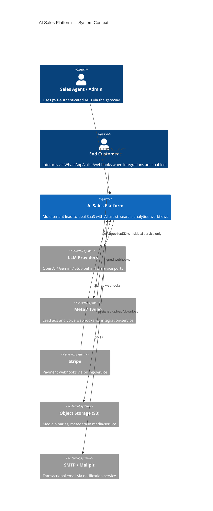

# C4 Level 1 — System Context

Grounded in the current repository layout (`backend/services`, `infrastructure/api-gateway`, `deployment/`).

## Notes (implemented)

- External entry is **API Gateway** (`infrastructure/api-gateway`), not individual service ports in production paths.
- AI vendors are never called from Lead/Deal/Workflow services; only `ai-service` owns provider adapters.
- Appointment and audit services are currently health-only scaffolds; gateway still routes `/api/v1/appointments/**` and `/api/v1/audit/**`.

## Related

- [c4-containers.md](c4-containers.md)
- [service-boundaries.md](service-boundaries.md)
- [../15-adr/adr-009-api-gateway.md](../15-adr/adr-009-api-gateway.md)
