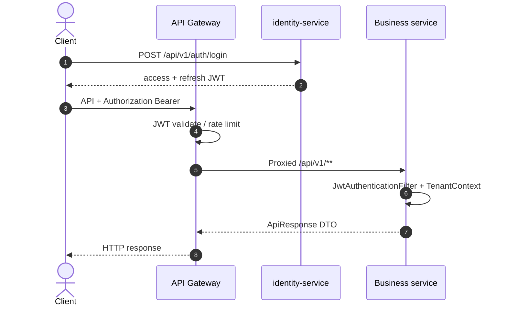
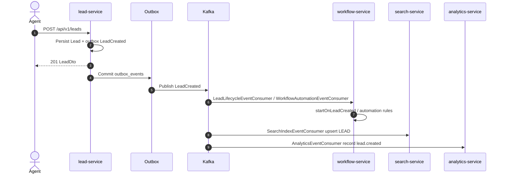
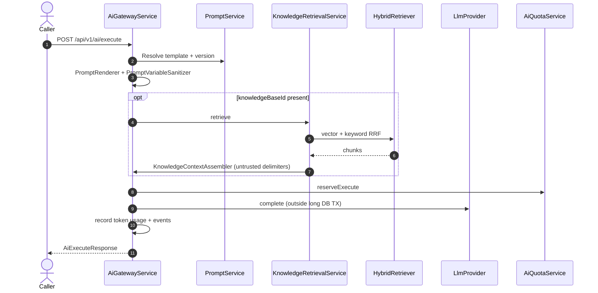
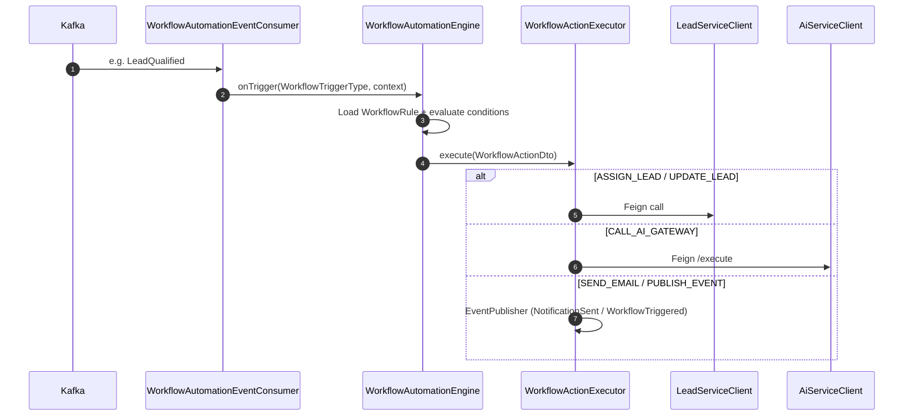

# Sequence Diagrams

Flows below reflect existing classes and APIs. They do not describe unimplemented product features.

## 1. Authenticated API call (gateway → service)

Sources: `AuthController`, `GatewayConfig`, `JwtAuthenticationFilter`.

## 2. Lead created → workflow + search + analytics

Sources: `LeadCreatedEvent.EVENT_TYPE`, consumers in workflow/search/analytics services, outbox tables per service.

## 3. AI execute with optional RAG

Sources: `AiGatewayController`, `AiGatewayService`, `HybridRetriever`, `KnowledgeContextAssembler`.

## 4. Workflow automation action

Sources: `WorkflowTriggerType`, `WorkflowActionType`, `WorkflowActionExecutor`.

## Related

- [c4-containers.md](c4-containers.md)
- [../06-ai-platform/ai-architecture.md](../06-ai-platform/ai-architecture.md)
- [../07-microservices/workflow.md](../07-microservices/workflow.md)
